# Federated Learning with COVID

## 1. Data and Model Configuration

There are 3 components for configuration, namely data integration, custom model integration and job definition.

### 1.1 First Component: Data Integration

On each of the client sites, the folder structure and the path of the data should be consistent. For classification, your dataset should have sub folders of all the classes to be considered for classification. For example, in our case there are two folders named covid and normal. Each of these folders contains the images of the respective classes. Each of the clients will have their own data, but the folder structure and path must remain the same.

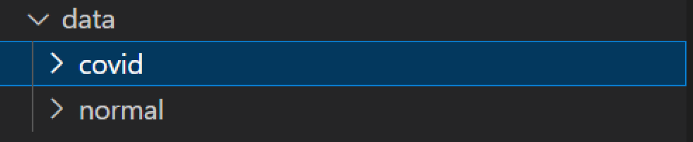

Here is a sample image from the covid folder.
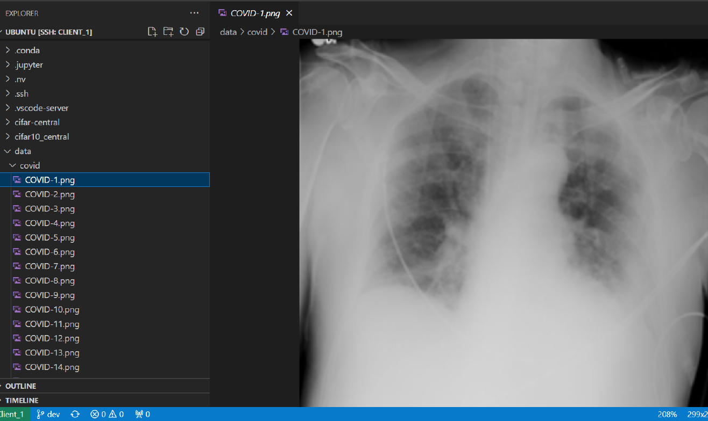

Here is a sample image from the normal folder.
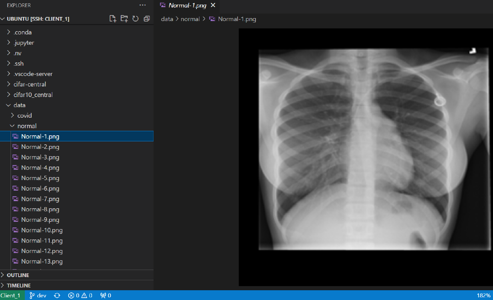

### 1.2 Second Component: Custom Model Integration

To integrate your custom model, the architecture has to be defined in the custom folder of the training job. In our example, the file is called covid_nets.py. As seen in the image, SimpleCNN is the architecture that has been defined. 

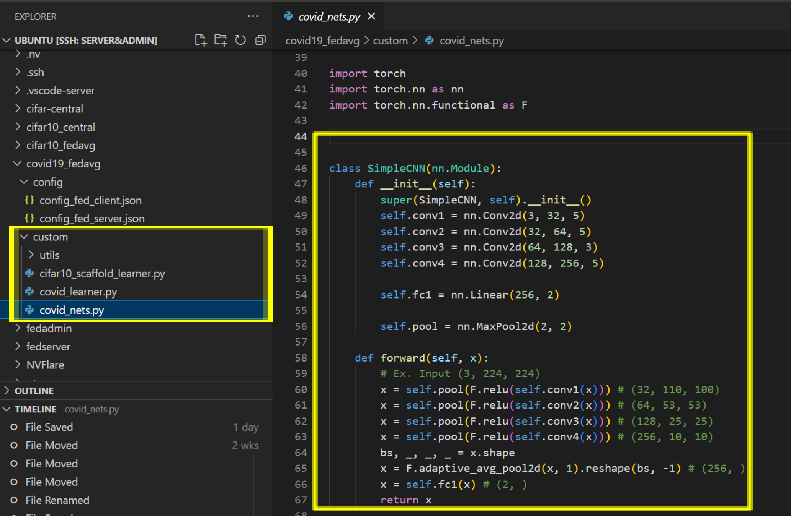

After defining the architecture, we need to import it in the learner file. In our case, the file is named covid_learner.py. All the training code is defined in this file. You need to plug in your model with two lines mentioned below.

On line 21, import your model architecture.

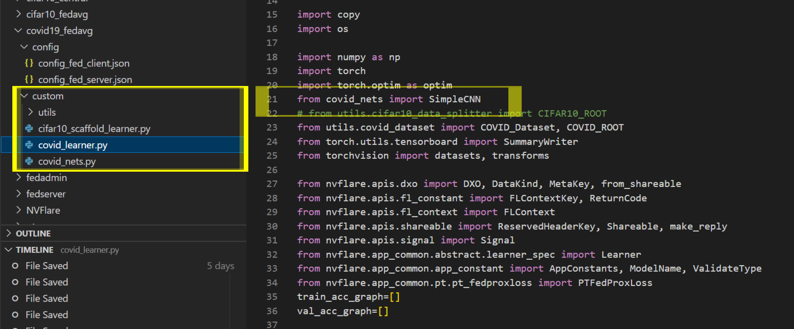

On line 136, set the model parameter to your architecture. In this code you can also change learning rate, optimizers, schedulers, etc. Hence a completely custom code is possible.

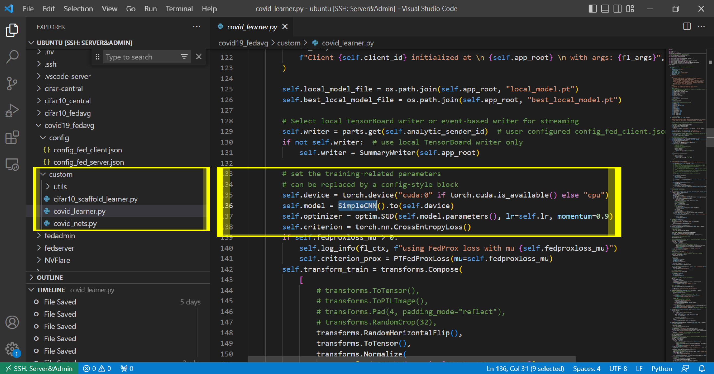

### 1.3 Third Component: Job Definition

The job parameters are defined in the config folder. This folder must have the two files named config_fed_client.json and config_fed_server.json. In config_fed_client.json, we can define the learning rate and aggregation epochs. Aggregation epochs are the epochs in local training after which the node sends updates to the server.

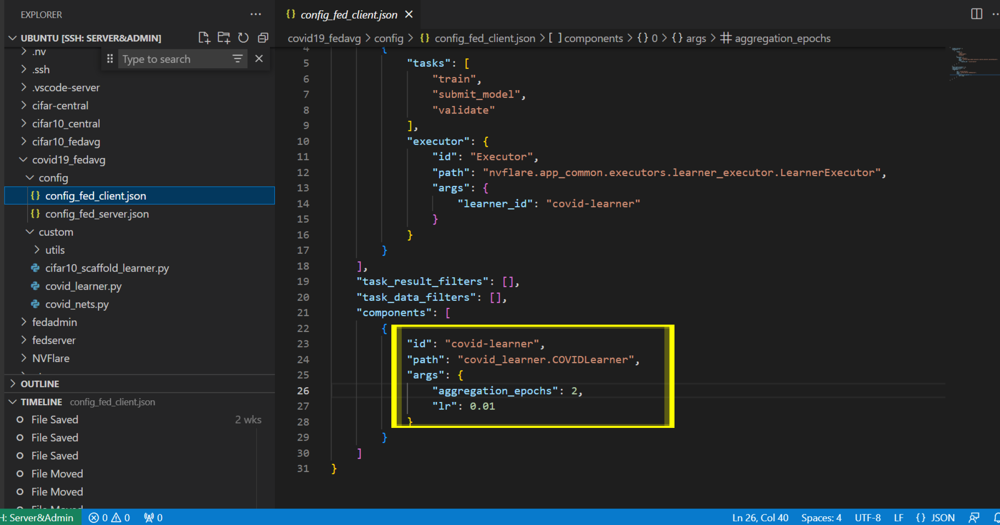

Config_fed_server.json defines the server configuration parameters. Here we mention the minimum clients, number of rounds of training and path of the model.

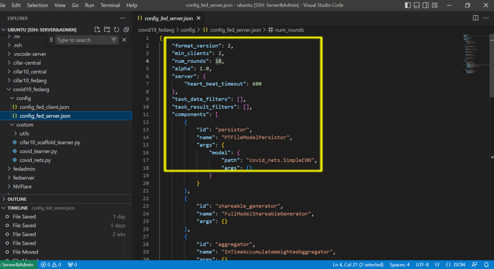


## 2. Simulated Federated Learning Experiments

This example includes instructions on running [FedAvg](https://arxiv.org/abs/1602.05629) algorithms using NVFlare's FL simulator.

All the following command should be executed under `covid-sim` subfolder unless otherwise stated.

### 2.1 Set up a virtual environment
```
python3 -m pip install --user --upgrade pip
python3 -m pip install --user virtualenv
```
(If needed) make all shell scripts executable using
```
find . -name ".sh" -exec chmod +x {} \;
```
initialize virtual environment.
```
source ./virtualenv/set_env.sh
```
install required packages for training
```
pip install --upgrade pip
pip install -r ./virtualenv/min-requirements.txt
```
(optional) if you would like to plot the TensorBoard event files as shown below, please also install
```
pip install -r ./virtualenv/plot-requirements.txt
```
Set `PYTHONPATH` to include custom files of this example:
```
export PYTHONPATH=${PWD}/..
export COVID_ROOT=${PWD}/../data
```

### 2.2 Download the COVID dataset 

If you are using Amazon Web Services (AWS) EC2, download the dataset from S3.

Go to IAM on AWS, and create 2 keys with reference foliowing [these steps](https://k21academy.com/amazon-web-services/create-access-and-secret-keys-in-aws/). Keep the keys in a secured file.
(./covid-sim/figs/iam_access.png)

**Please run the command under the root directory of this repo.**
```
aws configure
```
When prompted, enter the 2 keys generated in the previous step. Leave the "Default region name" and "Default output format" empty.
```
aws s3 sync s3://capstone-fed-learn/data/lung_classification/ data/
```

### 2.3 Run simulated FL experiments

We are using NVFlare's [FL simulator](https://nvflare.readthedocs.io/en/latest/user_guide/fl_simulator.html) to run the following experiments. 

First set the output root where to save the results
```
export RESULT_ROOT=/tmp/nvflare/sim_covid
```

#### 2.3.1 Varying data heterogeneity of data splits

We use an implementation to generated heterogeneous data splits based on a Dirichlet sampling strategy 
from FedMA (https://github.com/IBM/FedMA), where `alpha` controls the amount of heterogeneity, 
see [Wang et al.](https://arxiv.org/abs/2002.06440).

We use `set_alpha.sh` to change the alpha value inside the job configurations.

#### 2.3.2 Centralized training

To simulate a centralized training baseline, we run FL with 1 client for 20 local epochs but only for one round. 
It takes circa 6 minutes on an NVIDIA TitanX GPU.
```
./set_alpha.sh covid_central 0.0
nvflare simulator job_configs/covid_central --workspace ${RESULT_ROOT}/central --threads 1 --n_clients 1
```
Note, here `alpha=0.0` means that no heterogeneous data splits are being generated.

You can visualize the training progress by running `tensorboard --logdir=${RESULT_ROOT}`


#### 2.3.3 FedAvg on different data splits

FedAvg (8 clients). Here we run for 40 rounds, with 4 local epochs. Corresponding roughly 
to the same number of iterations across clients as in the central baseline above (40*4 divided by 8 clients is 20):
Each job will take about 35 minutes, depending on your system. 

You can copy the whole block into the terminal, and it will execute each experiment one after the other.
```
./set_alpha.sh covid_fedavg 1.0
nvflare simulator job_configs/covid_fedavg --workspace ${RESULT_ROOT}/fedavg_alpha1.0 --threads 8 --n_clients 8
./set_alpha.sh covid_fedavg 0.5
nvflare simulator job_configs/covid_fedavg --workspace ${RESULT_ROOT}/fedavg_alpha0.5 --threads 8 --n_clients 8
./set_alpha.sh covid_fedavg 0.3
nvflare simulator job_configs/covid_fedavg --workspace ${RESULT_ROOT}/fedavg_alpha0.3 --threads 8 --n_clients 8
./set_alpha.sh covid_fedavg 0.1
nvflare simulator job_configs/covid_fedavg --workspace ${RESULT_ROOT}/fedavg_alpha0.1 --threads 8 --n_clients 8
```

### 2.4 Results

Let's summarize the result of the experiments run above. First, we will compare the final validation scores of 
the global models for different settings. In this example, all clients compute their validation scores using the
same COVID-19 test set. The plotting script used for the below graphs is in 
[./figs/plot_tensorboard_events.py](./covid-sim/figs/plot_tensorboard_events.py) 
(please install [./virtualenv/plot-requirements.txt](./covid-sim/virtualenv/plot-requirements.txt)).

#### 2.4.1 Central vs. FedAvg
With a data split using `alpha=1.0`, i.e. a non-heterogeneous split, we achieve the following final validation scores.
One can see that FedAvg can achieve similar performance to central training.

| Config	| Alpha	| 	Val score	| 
| ----------- | ----------- |  ----------- |
| covid_central | 1.0	| 	0.83700	| 
| covid_fedavg  | 1.0	| 	0.82425	| 


#### 2.4.2 Impact of client data heterogeneity

We also tried different `alpha` values, where lower values cause higher heterogeneity. 
This can be observed in the resulting performance of the FedAvg algorithms.  

| Config |	Alpha |	Val score |
| ----------- | ----------- |  ----------- |
| covid_fedavg |	1.0 |	0.82425 |
| covid_fedavg |	0.5 |	0.83100 |
| covid_fedavg |	0.3 |	0.78450 |
| covid_fedavg |	0.1 |	0.74150 |


#### 2.4.3 FedAvg vs. FedProx vs. FedOpt 
Finally, we compare an alpha setting of 0.1, causing a high client data heterogeneity and its impact on more advanced FL algorithms, namely FedProx and FedOpt. FedOpt achieve better performance compared to FedAvg and FedProx with the same alpha setting. However, FedOpt show markedly better convergence rates. FedOpt utilizes SGD with momentum to update the global model on the server. 
| Config |	Alpha |	Val score |
| ----------- | ----------- |  ----------- |
| covid_fedavg |	0.1 |	0.71650 |
| covid_fedprox |	0.1 |	0.74325 |
| covid_fedopt |	0.1 |	0.79500 |

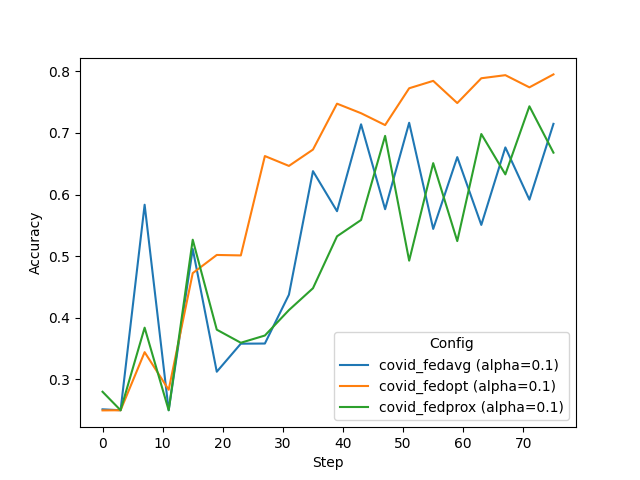

## 3. Real-world FL experiments

### 3.1 Provisioning

The provisioning process establishes the identities of the server, clients and admin, generating mutual-trusted system-wide configurations for all participants so all of them can join the NVIDIA FLARE system across different locations.

Here folders are created on the server for the whole system. Folders are created for the admin, server and all the clients. These folders contain FLARE scripts and other essential code. These are also signed by the servers so that no one can alter code on any instance. 

To begin with, edit the project.yml file on server instance. Mention the ipv4dns address of the servers and mention all the clients in the system. By default the ports are 8102 and 8103 for server and admin respectively. If you are using AWS, you may find the details in the instance summary. Please refer to the project.yml file in the git repository for the full version.

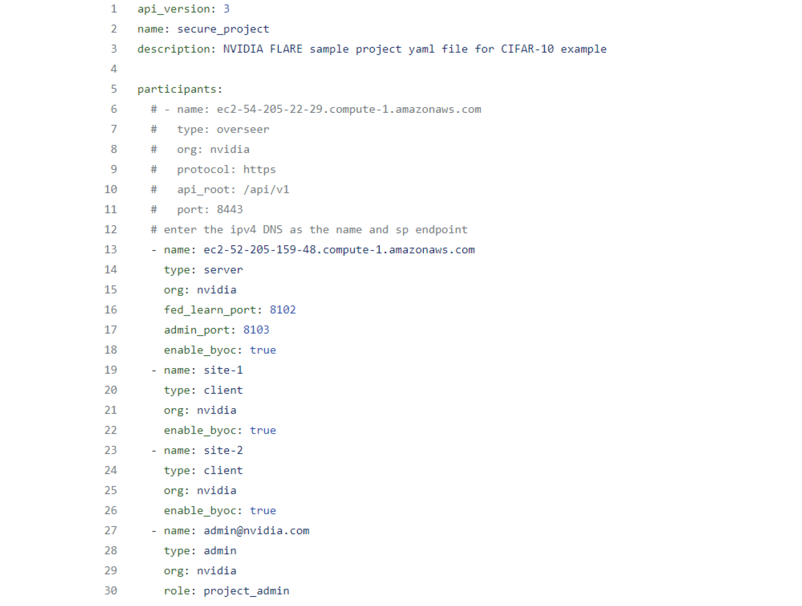

After setting up the project.yml file, run command: `provision -p project.yml`. A new folder named workspace will be generated. It will contains a sub folder named prod_00 which has all the provisioned folders.

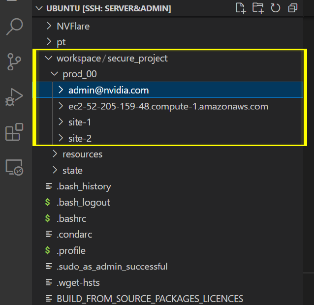

### 3.2 Set Up Server, Client and Admin

Create two folders fedserver and fedadmin on server. Move the admin folder to fedadmin and server folder fedserver. Move the site 1 and site 2 folder to client 1 and client 2. Parallely run the following commands. You may open three terminals to do so.

**Server**: cd to fedserver and startup folder. Run the bash command `./start.sh` to start the server.

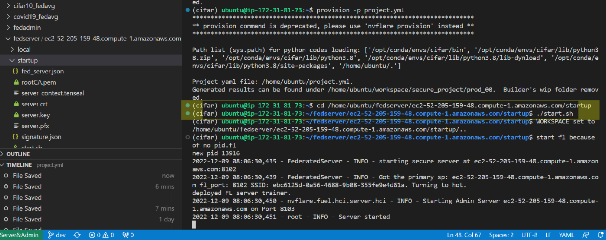

**Client 1**: cd to site-1 and startup folder. Run the bash command `./start.sh` to start client 1.

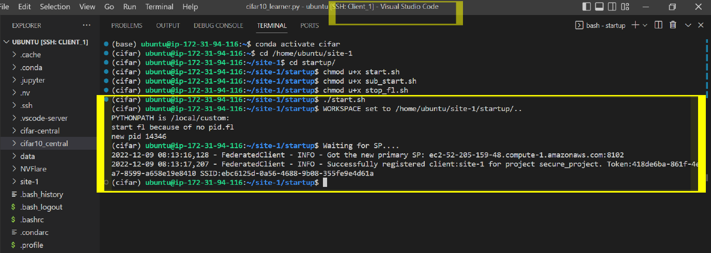

**Client 2**: cd to site-2 and startup folder. Run the bash command `./start.sh` to start client 1.

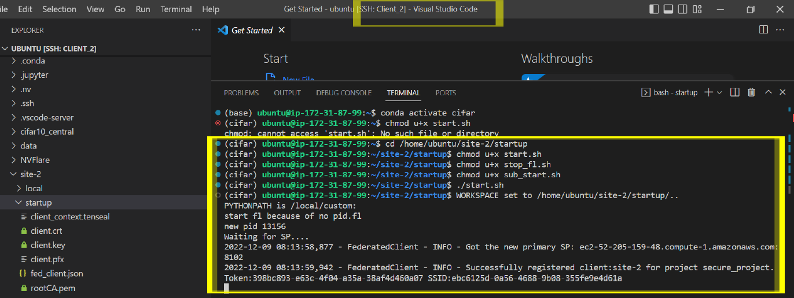

Server output shows that the 2 clients are connected to the server.

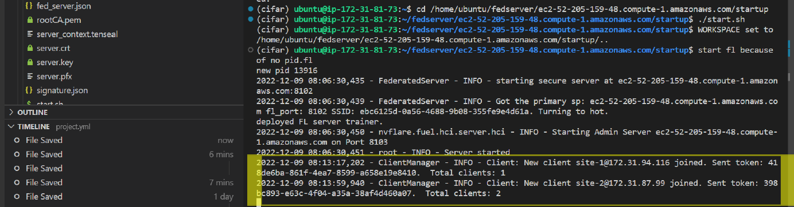

**Admin**: In another terminal, go to fedadmin folder in the startup folder. Run the command `./fl_admin.sh`. The username by default is: admin@nvidia.com

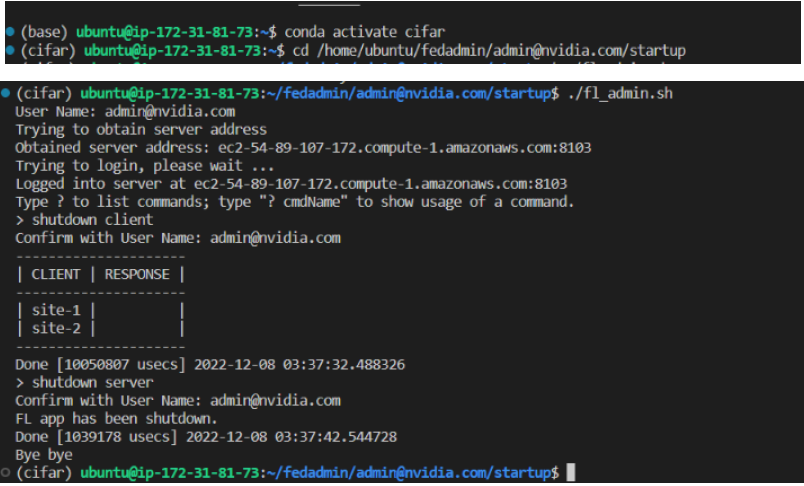

### 3.3 Run the FL Experiment

The training job is saved in a folder at the server. In this example, the folder is named covid19_fedavg. The sub folder config contains client and server configuration files which have information such as number of epochs to run, data paths, etc. The sub folder custom has the code files which define network architectures and training algorithms.

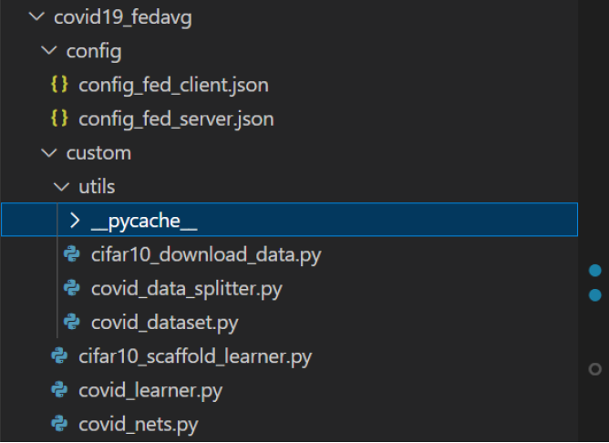

#### Submit training jobs

Run the command `submit _job {path_to_covid19_fedavg}`

Terminate training jobs

After training is complete shutdown the system using the following commands:

```
shutdown client
shutdown server
```

### 3.4 Results

#### 3.4.1 Experiment Parameters

We have experimented with the proof of concept with the following parameters.

- **Number of epochs**: 10 epochs on both instances. An epoch in machine learning means one complete pass of the training dataset through the algorithm.
- **Algorithm**: Federated averaging
- **Metric**: Validation metric

#### 3.4.2 Evaluation between Federated Clients

Here's accuracy on client 1 and client 2.

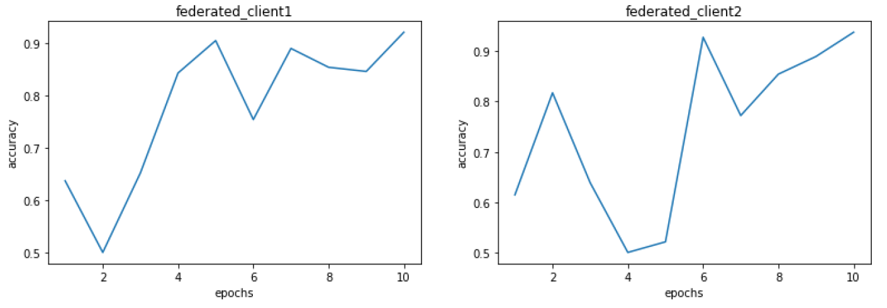

As we can see from the figures above, the accuracy of both nodes increases and crosses 90% towards the end of the training. For client 1, the accuracy catches up fast. For client 2, the accuracy catches up later. This may be because of the heterogeneous data in both clients. The model performances eventually converge because they share the same weights. The minor difference in accuracy is due to different data points.

#### 3.4.3 Evaluation between FL and Non-FL Setup

We compare the performance of every node in the FL setup to a non-FL setup. A non-FL setup means the traditional way to train the machine learning algorithm. Here we are simulating the centralized algorithm which trains on a client's individual set of data. In other words, each client will not receive global updates/weights from other parties.

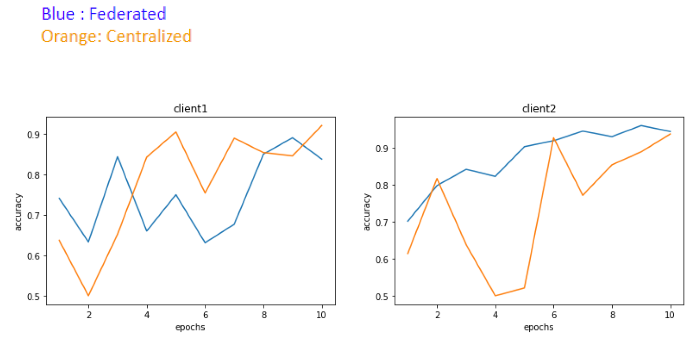

For client 1, the accuracy in non-FL setup is quite high. The federated learning accuracy is lower at the start because it receives the global updates from the server, which builds the updates based on the weights of client 2 too. As discussed in Section 6.3.2, Client 2 contains data noises, leading to low accuracy for client 1 in the beginning. However, the federated accuracy catches up in the later epochs. For client 2, the non-FL accuracy is very bad. However for the same epochs federated setup accuracy is high. Here we can see that FL setup is more stable and guaranteed accuracy even in the worse scenario.


## Credits

- https://github.com/NVIDIA/NVFlare/tree/dev/examples/cifar10
- https://k21academy.com/amazon-web-services/create-access-and-secret-keys-in-aws/
